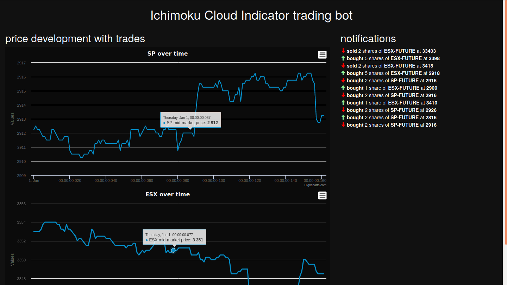

# Hack The Burgh - VI
# Project - Trading Bot for the Optiver Challenge

The Challenge is to create a trading algorithm to make money by buy and selling stocks on two indeces : S&P500 (SP) and Eurostoxx (ESX).

Our project is composed of three parts:

1) The trading algorithm itself
2) An SMS alert functionality to communicate profits and losses
3) A Web page for data visualization

## **1 - Algorithm**
We use the Ichimoku Cloud Indicator, a fairly safe and simple strategy especially for Microtrading.
The indicator is based on four components:
1) Conversion Line -> midpoint of the last 9 average prices
2) Base Line -> midpoint of the last 26 average prices
3) Leading Span A -> midpoint of Conversion Line and Base Line
4) Leading Span B -> midpoint of the last 52 average prices

**Trading Strategy**:
The Leading Spans consitute the boundaries of the "cloud". When Leading Span A is moving above Leading Span B it indicates an uptrend is gaining momentum. Conversly, Leading Span B above means a downward trend is taking place. A thin cloud shows indecision and a potentially weakening trend, whereas a wide one means it is a good time to start trading.

If the trend is Up and the Conversion Line falls below the Base Line, then it is time to buy stocks. Similarly, when the crossover of Conversion Line and Base Line happens in the opposite direction, it is time to sell.
To contain risk, we are allowing the bot to buy only two stocks on each market (four in total) for every "trading period".

## **2 - SMS alert**
The SMS alert system will send a notification to the user when a trade is closed, communicating losses and profit.

Some screenshots of the SMS functionality:
<table>
  <tr><td></td><td></td></tr>
</table>

## **3 - front-end**
1) `cd front_end/`
2) `python -m SimpleHTTPServer`
3) go to `0.0.0.0:8000`

The following shows an impression of what our front-end looks like.
The graphs show the mid-market prices for the SP and ESX instruments, respectively.
We plan to broadcast the trades our bot makes over SocketIO, which we can also show in the graphs as a scatterplot.
NB: currently, the front-end only shows static data. When we get the SocketIO integration set up, we hope that we can update the chart in real time.

## Authors
[Mihail Yonchev](https://github.com/slaifan)  
[Nout Kleef](https://github.com/nout-kleef)  
[Vincenzo Incutti](https://github.com/enzo-inc)
